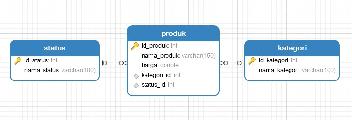

# TES Programmer FASTPRINT.CO.ID
Aplikasi ini dibuat dengan menggunakan Framework Codeigniter 4 [official site](https://codeigniter.com).
Berikut desain database yang akan dipakai pada mini aplikasi ini.

# requirement PHP
Untuk menjalankan mini aplikasi ini disarankan menggunakan php 7.4 Ke atas.

# File database
Sudah disertakan dalam repo ini dengan file tesprogrammer.sql

